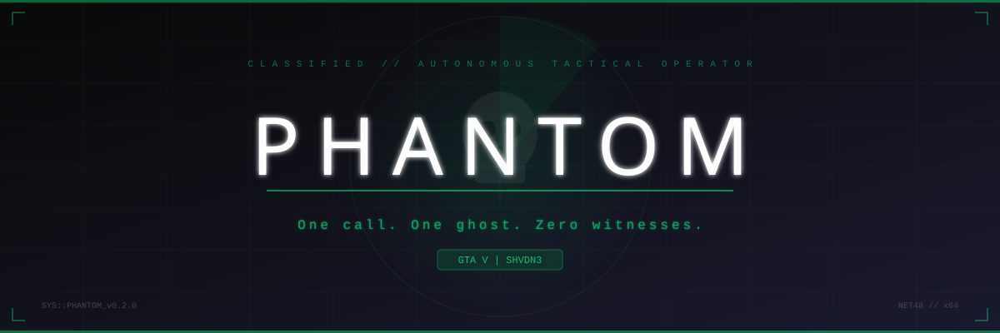
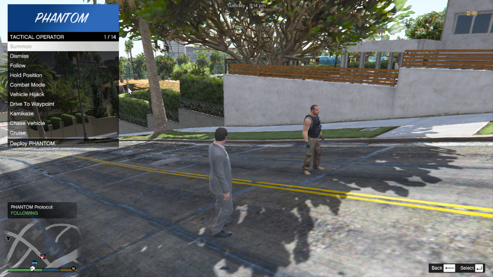
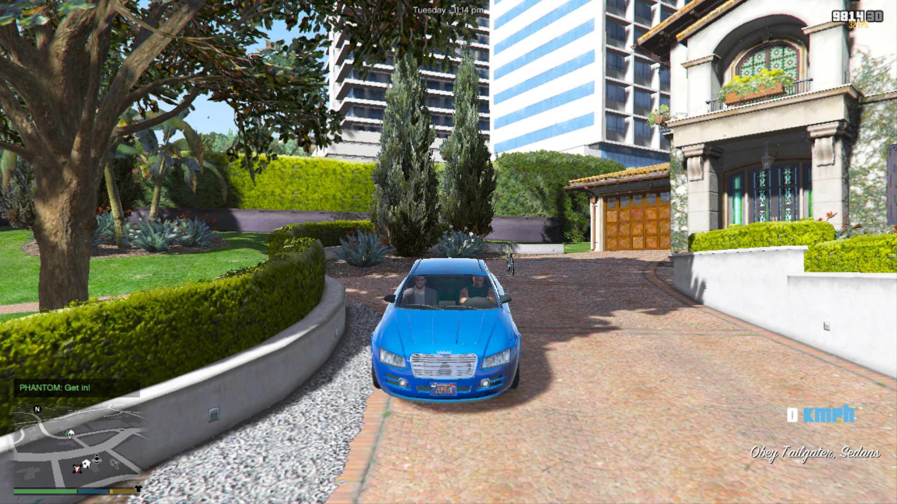

<p align="center">
  
</p>

<p align="center">
  <strong>Autonomous tactical NPC operator mod for Grand Theft Auto V</strong>
</p>

<p align="center">
  <a href="https://github.com/uzairdeveloper223/phantom/releases/latest"></a>
  <a href="https://github.com/uzairdeveloper223/phantom/blob/main/LICENSE"></a>
  
  
  
</p>

---

## About

PHANTOM is a Script Hook V .NET mod that deploys an autonomous AI companion into GTA V. The companion operates as a fully independent tactical unit: following the player, engaging hostiles, hijacking vehicles on command, calling in backup squads, coordinating extraction helicopters, and synchronizing parachute drops.

One call. One ghost. Zero witnesses.

---

## Features

### Core Companion
- Persistent AI companion with configurable ped model and loadout.
- Follow, Wait, and Dismiss command system with realistic radio animations.
- Intelligent passenger entry: if the player gets into any vehicle, PHANTOM automatically scans for empty seats and boards the vehicle as a passenger to ride shotgun.
- Health regeneration system that kicks in after a delay when out of combat.
- Drive-by shooting capabilities when riding in passenger seats.
- Dynamic LemonUI menu displaying read-only metrics in real-time, including distance from player to PHANTOM and distance from PHANTOM to the active target.

### Vehicle Operations
- **Hijack**: PHANTOM steals the nearest vehicle and delivers it to the player.
- **Cruise**: Autonomous patrol driving.
- **Drive To**: Navigate directly to a specified map destination.
- Board hijacked vehicles instantly with a proximity prompt.

### Tactical Aiming HUD & Lock-On System
- **Tactical Aiming HUD**: Enter targeting mode, aim at any ped or vehicle, and press the T key to lock on.
- **Real-Time Stats Board**: A tactical overlay in the top-right displays the target's Class (Infantry or Vehicle), Vehicle Model Name, Occupant Count (via real-time seat scanning), Distance in meters, and Health percentage.
- **Holographic 3D Chevron**: Draws a floating red or blue thick chevron in 3D space above the target's head, which tracks them in real time as they move.
- **Snappy Menu Transition**: Locking a target triggers an audio cue, marks the target as mission-critical to prevent despawning, and automatically opens the Kamikaze attack menu.
- **Gunfight Avoidance**: Friendly backup units and PHANTOM automatically ignore the active target in general combat targeting, ensuring they are not gunned down before the Kamikaze attack can strike.

### Advanced Kamikaze Operations
- **Attack Modes**: Choose between Suicide Bomb, Ram & Explode, and Execute modes.
- **Bumper-to-Bumper Collision Detonation**: Upgraded suicide bomb and ram-explode attacks check for native physical bumper contact and a realistic vehicle-center radius (7.0m for suicide, 7.5m for ramming speed) to detonate the explosion instantly upon physical touch.
- **Foot-Based Kamikaze Bypass**: If the target vehicle is within 40 meters and has no driver or the driver is dead, PHANTOM bypasses finding a vehicle and sprints directly to the target on foot to detonate the explosion on contact.
- **Vehicle Retention**: If PHANTOM is already sitting inside a vehicle when the attack is ordered, they immediately use that car to execute the charge. For safety, if they are in your vehicle, they will exit it first.
- **Dynamic Abort & Retrieval**: Cancel the Kamikaze attack at any time. If PHANTOM is far (> 45 meters) when aborted, they hijack a vehicle and drive back to you. They pull up and get out if you are on foot, or stay inside to escort if you are in a vehicle.

### Premium Backup Ground Chase & Escort Engine
- Ground backup convoys follow you with an advanced, aggressive chase and steering system.
- **Dynamic Power Rubberbanding**: Convoys dynamically scale engine torque up to a 5.0x power multiplier when lagging behind to keep pace with high-speed supercars.
- **Convoy Signals**: Backup vehicles flash high beams and sound their horn periodically to clear ambient civilian traffic when lagging behind.
- **Anti-Stutter AI**: Escort commands are throttled to 5.0 seconds, giving the driving AI uninterrupted time to calculate smooth steering and paths instead of continuously resetting or braking.
- **Out-of-Sight Spawning**: The teleport fallback is increased to 150 meters and queries roadway nodes to spawn vehicles organically behind the player, out of your direct line of sight.

### Backup Deployment & Air Support
- Spawns ground squads and vehicle convoys up to 4 units.
- Air support: Buzzard attack helicopters with armed black ops gunners.
- Automatic backup dispatching when player health drops to critical levels.

### Extraction System
- Spawns an Annihilator extraction helicopter that circles overhead.
- Mark your landing zone by throwing a flare. The helicopter lands precisely on the flare.
- Board the helicopter as a passenger with a proximity prompt.
- **Drop at Waypoint**: Set a map waypoint and the helicopter flies you there with distance tracking.

### Parachute Sync
- PHANTOM auto-deploys a parachute when the player does.
- Descent position is synchronized 4 meters to the right.
- Smooth lerped movement ensures a cinematic freefall.

---

## Screenshots

<p align="center">
  
  
</p>

---

## Installation

### Requirements

| Dependency | Version | Link |
|---|---|---|
| GTA V | Latest | -- |
| Script Hook V | Latest | [Download](http://www.dev-c.com/gtav/scripthookv/) |
| Script Hook V .NET | 3.x | [Download](https://github.com/scripthookvdotnet/scripthookvdotnet/releases) |
| .NET Framework | 4.8 | [Download](https://dotnet.microsoft.com/download/dotnet-framework/net48) |
| LemonUI | 1.5+ | Bundled with SHVDN |

### Steps

1. Install **Script Hook V** and **Script Hook V .NET** into your GTA V root directory.
2. Download the latest release from the Releases page.
3. Extract the archive. Copy `PHANTOM.dll` and `PHANTOM.ini` into your `GTA V/scripts/` folder.
4. Launch GTA V.
5. Press `F10` to open the PHANTOM menu.

### Directory Structure

```
Grand Theft Auto V/
  scripts/
    PHANTOM.dll
    PHANTOM.ini
```

---

## Configuration

All settings are in `PHANTOM.ini`, placed alongside the DLL:

```ini
[General]
PedModel=s_m_y_blackops_01
ActivationKey=F10

[Weapons]
Primary=WEAPON_CARBINERIFLE
Secondary=WEAPON_PISTOL

[Driving]
DrivingSpeed=80
DrivingFlags=786603

[Health]
HealthRegenAmount=5
HealthRegenInterval=3000
HealthRegenDelay=5000
```

---

## Building from Source

Most users do not need to build from source. Pre-built releases are available as zip archives on the Releases tab.

### Requirements

- .NET SDK 8.0+
- NuGet packages restore automatically

### Build

```bash
git clone https://github.com/uzairdeveloper223/phantom.git
cd phantom
dotnet restore
dotnet build
```

The output DLL is written to the path configured in `PHANTOM.csproj`.

---

## Architecture

```
src/
  PhantomMain.cs      Main script entry, state machine, tick handlers
  PhantomPed.cs       Companion ped lifecycle and configuration
  PhantomTasks.cs     AI task logic (hijack, combat, driving)
  PhantomBackup.cs    Backup squads, air support, extraction heli
  PhantomMenu.cs      LemonUI menu system and user input
  PhantomState.cs     State enum (Following, Combat, Hijack, etc.)
```

---

## References

| Resource | URL |
|---|---|
| Script Hook V | [dev-c.com/gtav/scripthookv](http://www.dev-c.com/gtav/scripthookv/) |
| Script Hook V .NET | [github.com/scripthookvdotnet](https://github.com/scripthookvdotnet/scripthookvdotnet) |
| GTA V Native DB | [nativedb.dotindustries.dev](https://nativedb.dotindustries.dev/natives) |
| LemonUI | [github.com/LemonUIbyLemon](https://github.com/LemonUIbyLemon/LemonUI) |
| SHVDN3 API | [scripthookvdotnet docs](https://scripthookvdotnet.github.io/) |

---

## Known Bugs

- Unusual behavior of the backup convoy
- Other bugs can be reported on GitHub

---

## License

This project is licensed under the MIT License.

---

## Author

**Uzair Mughal**

- GitHub: [uzairdeveloper223](https://github.com/uzairdeveloper223)

---

<p align="center">
  <sub>Built with Script Hook V .NET 3 and native GTA V APIs.</sub>
</p>
